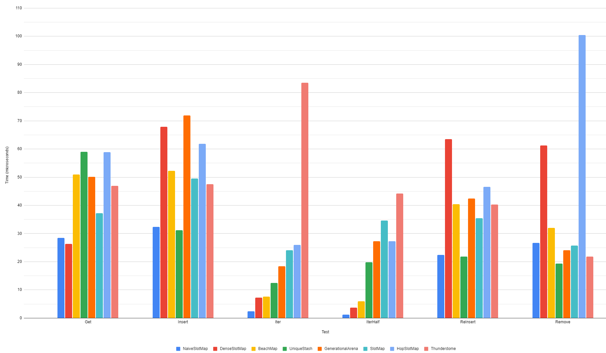
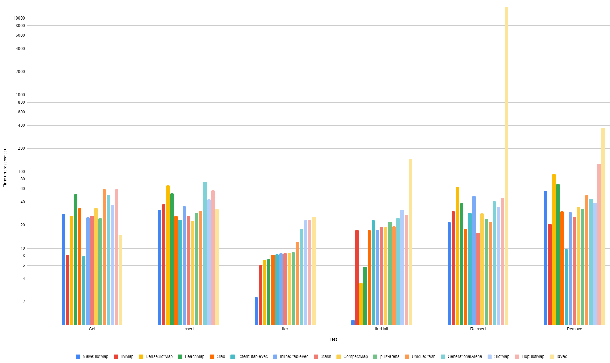
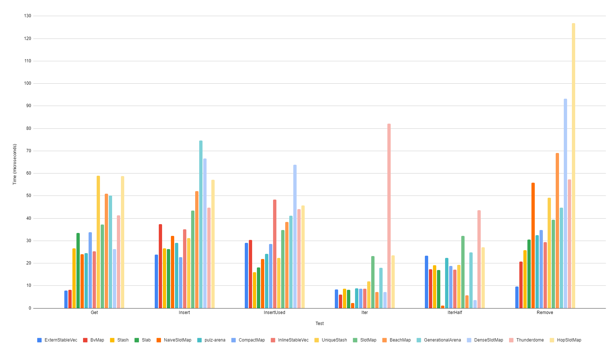

# Procedure
  
| Test       | Setup                                                                                        | Benchmark                            |
|------------|----------------------------------------------------------------------------------------------|--------------------------------------|
| Get        | - Create an empty arena. - Insert 10,000 entities.                                        | Get 10,000 entities randomly.        |
| Insert     | - Create an empty arena.                                                                     | Insert 10,000 entities.              |
| InsertUsed | - Create an empty arena. - Insert 10,000 entities. - Remove all entities sequentially. | Insert 10,000 entities.              |
| Iter       | - Create an empty arena. - Insert 10,000 entities.                                        | Iterate over the arena sequentially. |
| IterHalf   | - Create an empty arena. - Insert 10,000 entities. - Remove 5,000 entities randomly.   | Iterate over the arena sequentially. |
| Remove     | - Create an empty arena. - Insert 10,000 entities. - Remove all entities sequentially. | Remove all entities randomly.        |

# Benchmarks: Generational Arenas
This includes benchmarks for crates typically considered to be generational arenas. `idvec` is
omitted from these charts because some of its operations take a log time, blowing up the scale.

This was run on an [AMD 3950x](https://www.amd.com/en/products/cpu/amd-ryzen-9-3950x).

## Linear graph - `idvec` removed

# Benchmarks: All
This includes benchmarks for things that aren't considered generational arenas. A sperate chart is
available with `idvec` removed.

## Log graph

## Linear graph - `idvec` removed
